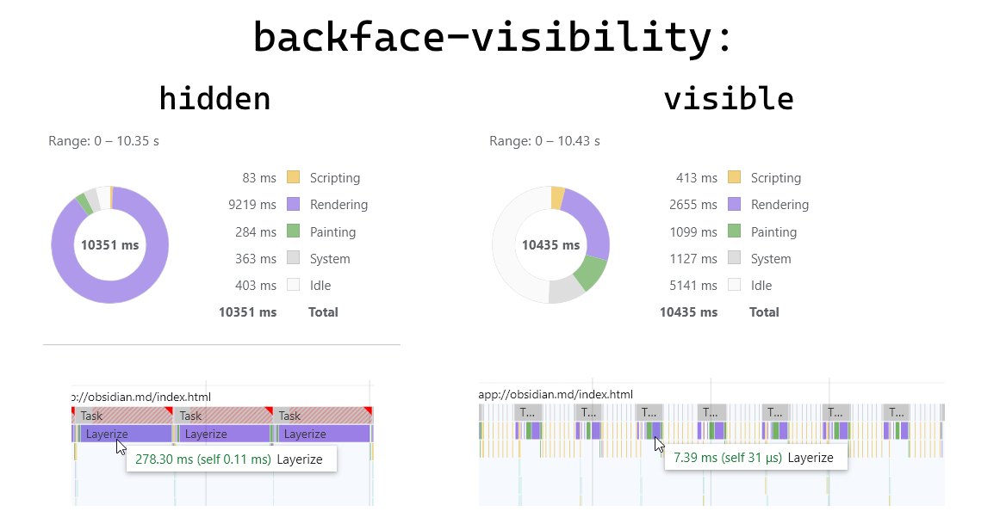

# Obsidian Canvas Performance Patch Plugin

This plugin was developed to address 2 issues I discovered that drastically reduce the performance of the canvases in Obsidian, especially those with a lot of media embeds.

This plugin may be handy for anyone who would like to improve usability of Obsidian canvases before official patch release as well as for Obsidian developers to easily resolve the issues.

## Installation

To install the plugin, download files `styles.css`, `manifest.json` and `main.js` from the latest release on this repository. Then create directory named `canvas-performance-patch` within the `.obsidian/plugins` directory of your vault and copy all 3 files there. At last, enable the plugin under the community plugins settings within Obsidian.

## The issues

### #1 - Node remounting bug

Most of the canvas node types are replaced with a lightweight preview when zoomed out. But media embeds are an exception - they're made to be visible at any zoom level. Due to the bug media embeds are removed and inserted right back every frame when user navigates a canvas while zoomed out.

Here's the simplified unminified chunk of the Obsidian code that illustrates the bug for anyone who might be interested:

```javascript
class Node {
	updateBreakpoint(closeEnough) {
		super.updateBreakpoint(closeEnough);

		if (closeEnough) {
			this.mountContent();
		} else {
			this.unmountContent();
		}
	}
}

class FileNode extends Node {
	updateBreakpoint(closeEnough) {
		super.updateBreakpoint(closeEnough); // <- problem here
		// updateBreakpoint from Node is called. This means that if the
		// canvas is zoomed out, the content will be dismounted. 

		// But this code realizes that this is a media embed and mounts
		// the node content right back. This happens for every MediaEmbed
		// node on every frame when navigating a canvas
		if (closeEnough) {
			this.mountContent();
		} else {
			if (isMediaEmbed || isCanvasEmbed) { // simplified here
				this.mountContent();
			} else {
				this.unmountContent();
			}
		}
	}
}
```

The simplest way to solve this is to remove calling the parent updateBreakpoint within FileNode. This is what this plugin does leveraging monkey patching.

### #2 - CSS backface-visibility

Every canvas node has an element with class `canvas-node-content`. Obsidian defines a css property `backface-visibility: hidden;` for it. This property by itself causes canvas layout calculation to take significantly much more time.

*I'm not sure if this can be recreated on every platform, so here's my profiling on the canvas containing 432 image embeds visible at once. Each image is 3840x2160px.*


It's not entirely clear why this property is so detrimental on Obsidian canvases performance, but just removing it seems a good solution. This plugin uses own stylesheet to set `backface-visibility` to `visible`.